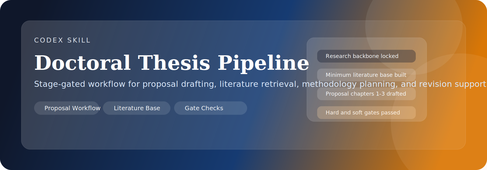
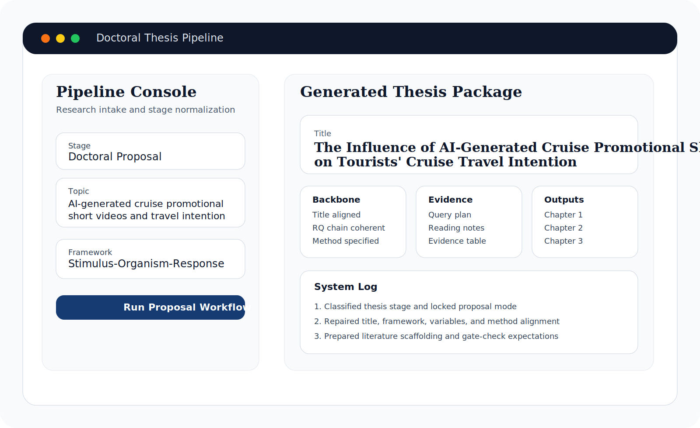
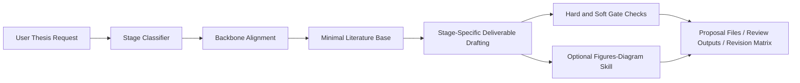

<p align="center">
  
</p>

<p align="center">
  
  
  
  
  
</p>

# Doctoral Thesis Pipeline

Stage-gated Codex skill for doctoral proposal and thesis drafting.

This repository packages a reusable academic workflow for turning rough thesis ideas into aligned research deliverables while preserving truthfulness, traceability, and backbone consistency across title, gap, framework, variables, method, evidence, and chapter outputs.

## At a Glance

- Proposal-ready workflow for Chapters 1-3
- Thesis-stage classification from topic selection to viva preparation
- Research-backbone alignment before prose expansion
- Traceable literature-base construction for current or niche topics
- Hard and soft gate checks before calling a draft usable
- Practical work-product orientation instead of advice-only prompting

## Preview

<p align="center">
  
</p>

## Architecture



## Best Fit

Use this skill for:

- PhD proposal drafting
- DBA and EdD thesis support
- literature review structuring
- methodology planning
- revision after supervisor feedback
- research-gap clarification

## What It Produces

Depending on the request, the skill can help produce:

- refined title options
- research gap statements
- proposal chapters 1-3
- hypotheses or propositions
- methodology plans
- revision matrices
- literature retrieval files

Common companion files include:

- `project_config.yaml`
- `research_plan.md`
- `references/query_plan.md`
- `references/candidate_papers.jsonl`
- `references/evidence_table.csv`
- `outputs/proposal_draft.md`
- `outputs/revision_matrix.md`

## Repository Layout

```text
SKILL.md
agents/
  openai.yaml
references/
  gates.md
  literature-retrieval.md
  proposal-workflow.md
scripts/
  semantic_scholar_search.py
assets/
  banner.svg
  preview.svg
```

## Quick Start

Install into your Codex skills directory:

```text
$CODEX_HOME/skills/doctoral-thesis-pipeline
```

Typical Windows path:

```text
C:\Users\<your-user>\.codex\skills\doctoral-thesis-pipeline
```

Example prompts:

- `Use $doctoral-thesis-pipeline to turn my rough topic into proposal chapters 1-3.`
- `Use $doctoral-thesis-pipeline to strengthen the logic of my methodology section.`
- `Use $doctoral-thesis-pipeline to create a literature review workflow and evidence table.`
- `Use $doctoral-thesis-pipeline to revise my proposal after supervisor feedback.`

## Semantic Scholar Script

The included script helps create a seed literature pool when `SEMANTIC_SCHOLAR_API_KEY` is available.

```bash
python scripts/semantic_scholar_search.py --query "AI tourism marketing" --limit 20 --out candidate_papers.jsonl
```

You can provide the API key through the process environment or `.env.local`.

## Companion Repository

- [`Figures-Diagram`](https://github.com/z595484296-dev/Figures-Diagram) for conceptual frameworks, methodology diagrams, taxonomies, timelines, and other non-numeric academic visuals

## Design Principles

- Do not fabricate citations, findings, coefficients, or sample statistics
- Prefer narrowing scope over forcing weak completeness
- Align title, framework, variables, and method before expanding prose
- Build evidence before writing from memory on unstable topics
- Produce files, not just commentary, when the user needs thesis work product

## License

MIT
